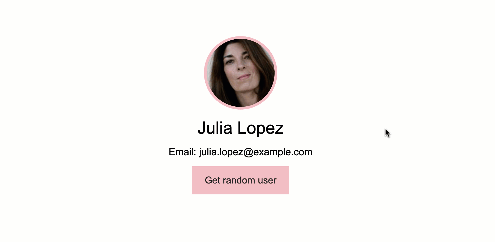

# RandomUser
### Simple Vue JS application using CDN



1. Create files 
* index.html
* style.css
* app.js

2. Add CDN script in body tag
```
<script src="https://unpkg.com/vue@3/dist/vue.global.js"></script> 
```

3. Scrip to your app.js
```
<script src="app.js"></script>
```

4. Create your app variable in js and mount it.
```
const app = Vue.createApp({
    ...
})
app.mount('#app')
```

5. To use data - create a function and it should return the object
```
const app = Vue.createApp({
    data(){
        return {
            firstName: 'First',
            lastName: 'Last',
            email: 'first.last@gmail.com',
            gender: 'female',
            picture: 'https://randomuser.me/api/portraits/women/10.jpg'
        }
    }
})
```

6. Add method getUser() to app, fetching data from the API randomuser.me/api
```
methods: {
        async getUser(){
            const res = await fetch("https://randomuser.me/api");
            const {results} = await res.json();
            this.firstName = results[0].name.first;
            this.lastName = results[0].name.last;
            this.email = results[0].email;
            this.gender = results[0].gender;
            this.picture = results[0].picture.large;
        }
    }
```

* **V-BIND** --> v-bind:src, v-bind:alt, v-bind:class
* **V-ON** --> v-on:click
